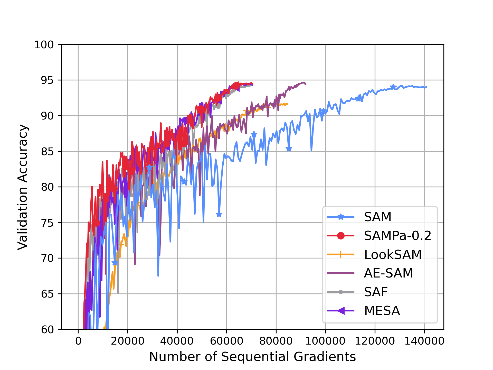
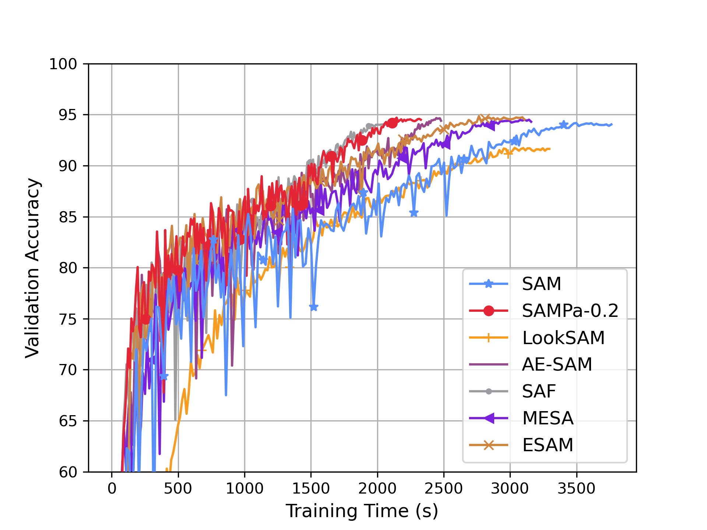

# SAMPa: Sharpness-aware Minimization Parallelized

This is the official code for [SAMPa: Sharpness-aware Minimization Parallelized]() accepted at NeurIPS 2024.

SAMPa introduces a fully parallelized version of sharpness-aware minimization (SAM) by allowing the two gradient computations to occur simultaneously:

<pre>
x<sub>t</sub>̃ = x<sub>t</sub> + ρ ∇f(y<sub>t</sub>) / ||∇f(y<sub>t</sub>)||
y<sub>t+1</sub> = x<sub>t</sub> - η<sub>t</sub> ∇f(y<sub>t</sub>)
x<sub>t+1</sub> = x<sub>t</sub> - η<sub>t</sub> (1 - λ) ∇f(x<sub>t</sub>̃) - η<sub>t</sub> λ ∇f(y<sub>t+1</sub>)
</pre>

where the gradients $\nabla f(\widetilde{x}_t)$ and &nabla;f(y<sub>t+1</sub>) are computed in parallel, significantly improving efficiency.

SAMPa serves as one of the most efficient SAM variants:

 

## Setup

```
conda create -n sampa python=3.8
conda activate sampa

# On GPU
conda install pytorch torchvision torchaudio pytorch-cuda=12.1 -c pytorch -c nvidia

pip install -r requirements.txt
```


## Usage

This code is for SAMPa's implementation. It parallelizes two gradient computations on 2 GPUs. 
Specifically in `train.py`, `global_rank:0` handles $\nabla f (\widetilde{x}_t)$ and `global_rank:1` handles &nabla;f(y<sub>t+1</sub>).

To train ResNet-56 on CIFAR-10 using SAMPa, use the following command:

```
CUDA_VISIBLE_DEVICES=0,1 python train.py --model resnet56 --dataset cifar10 --rho 0.1 --epochs 200
```


<!-- ## Citation
```
@inproceedings{xie2024improving,
  title={{SAMPa}: Sharpness-aware Minimization Parallelized},
  author={Xie, Wanyun and Pethick, Thomas and Cevher, Volkan},
  booktitle={Advances in Neural Information Processing Systems (NeurIPS)},
  year={2024}
}
```  -->
